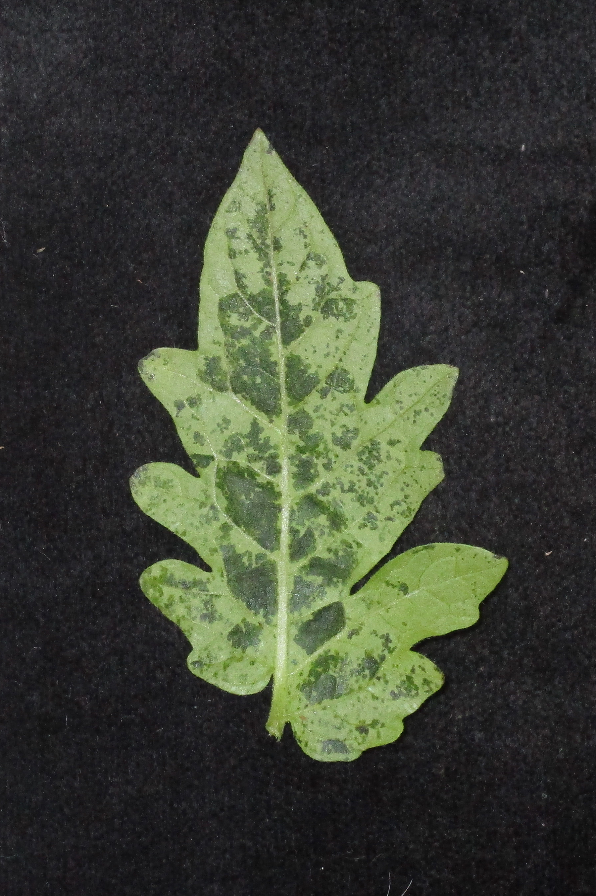
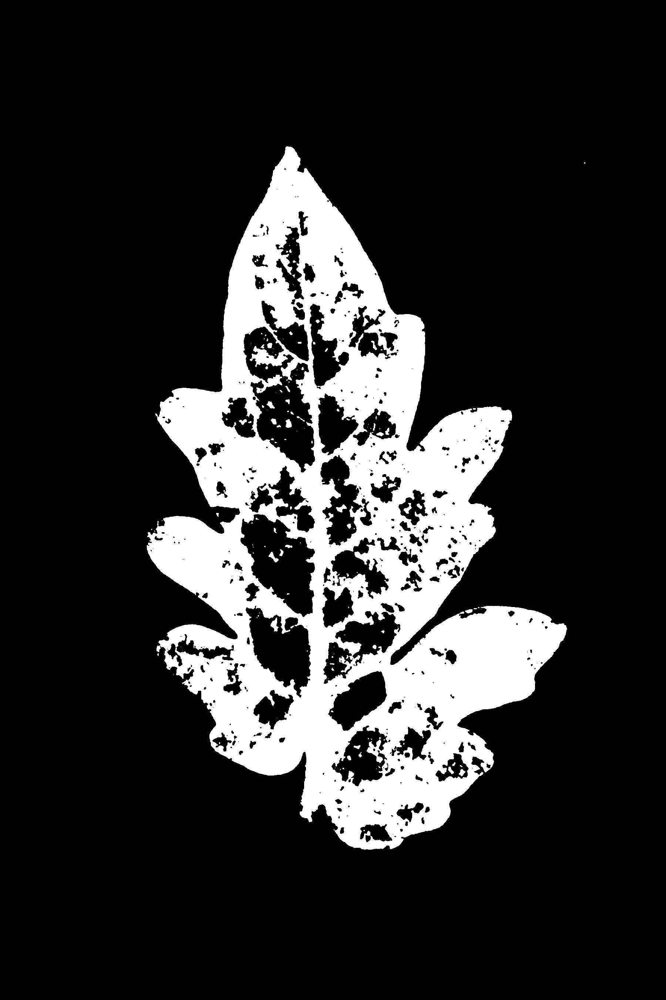

# plant-pathology-image-processor
extract information from plant pathlogy images

> Setup and Execution

1. Create a virtual environment

```bash
conda create -n plant-pathology-image-processor python=3.7
```
2. Activate the virtual environment

```bash
conda activate plant-pathology-image-processor
```
3. Install the requirements

```bash
pip install -r requirements.txt
```

4. Add input images to the folder `input_images`
5. Results are stored in the folder `results`
   1. `results/leaf_area_binaries` contains the leaf area binary images
   2. `results/lesion_area_binaries` contains the lesion area binary images
   3. `output.csv` contains the results of the program
6. Run the program

```bash
python3 lesion_detector.py
```
> Example

Original image           | Leaf area binary           |  Non-lesion area binary
:-------------------------:|:-------------------------:|:-------------------------:
  |   |  