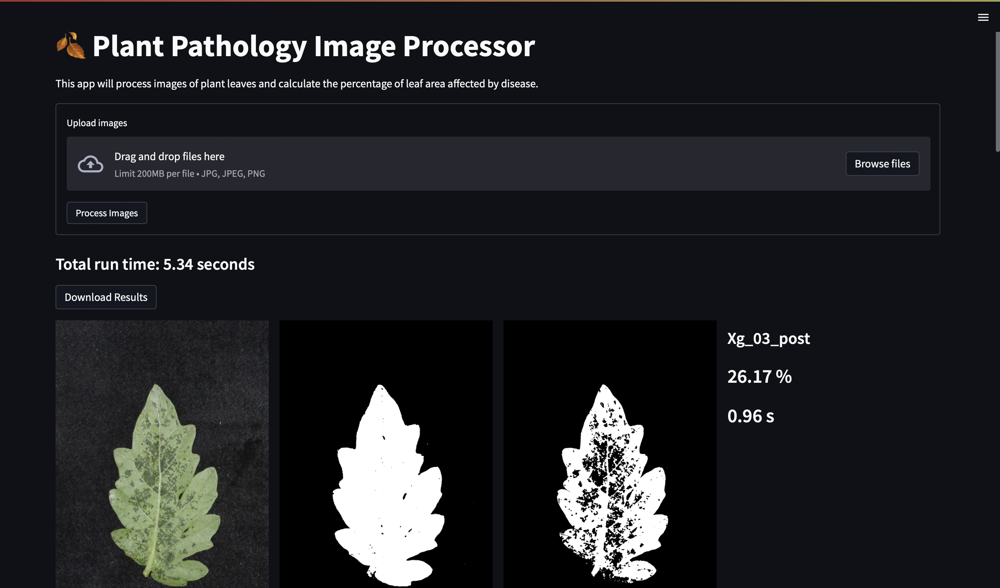

# plant-pathology-image-processor
extract information from plant pathlogy images

> Setup and Execution

1. Create a virtual environment

```bash
conda create -n plant-pathology-image-processor python=3.7
```
2. Activate the virtual environment

```bash
conda activate plant-pathology-image-processor
```
3. Install the requirements

```bash
pip3 install -r requirements.txt
```

4. Run the streamlit app

```bash
streamlit run src/leaflesiondetector/app.py
```

