Image Name | Original image | Leaf area binary |  Non-lesion area binary | Percentage Area Affected |
:---:|:---:|:---:|:---:|:---:
Xg_03_post.jpeg|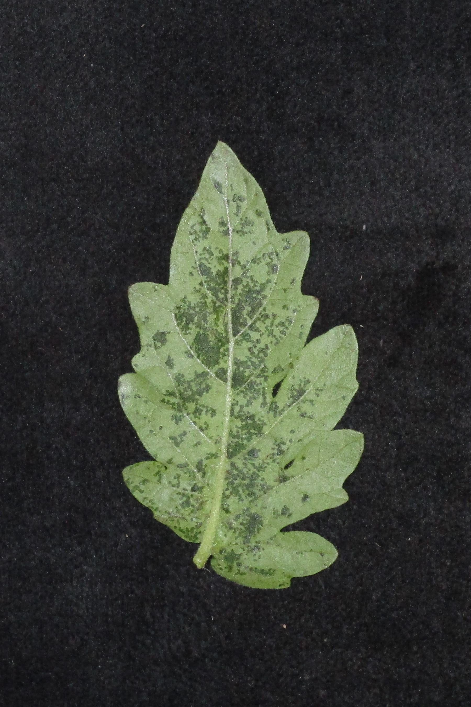 | 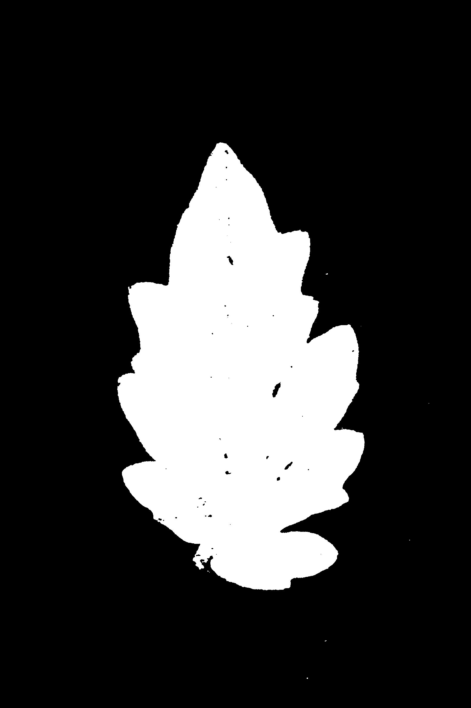 | 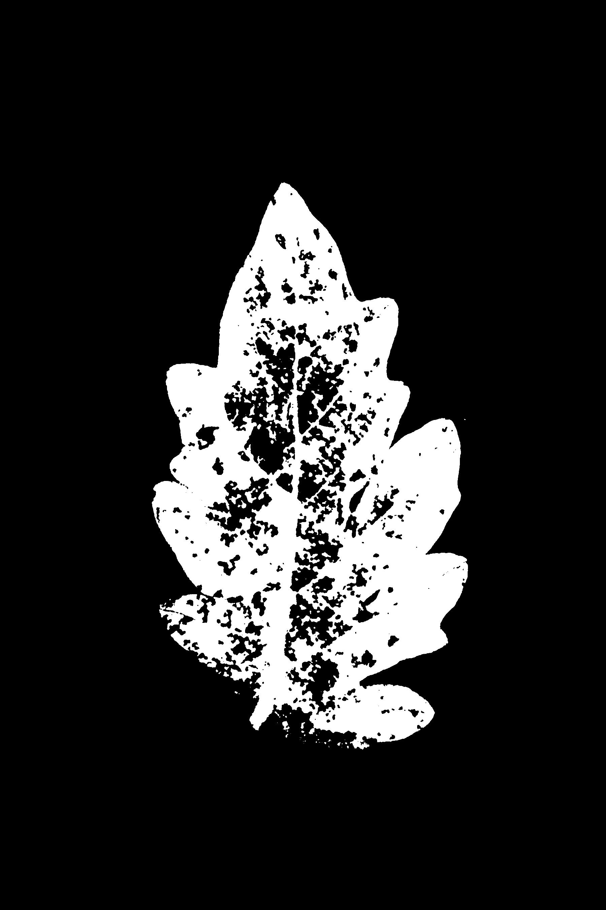 | 0.26 %
Xg_05_post.jpeg|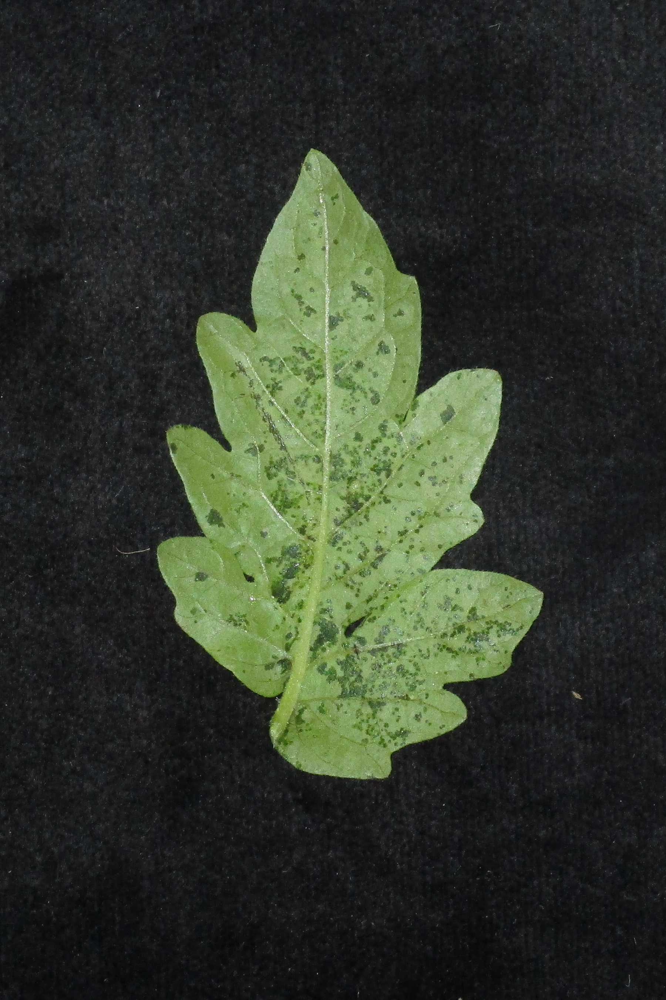 | 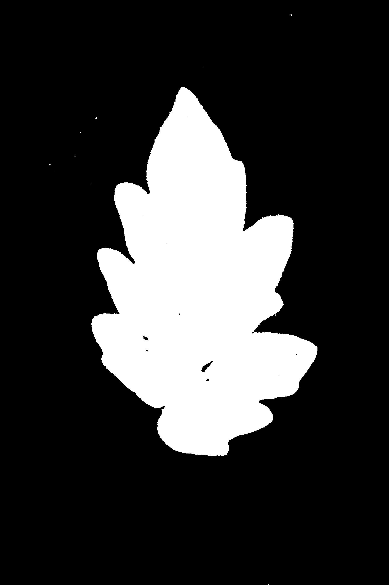 | 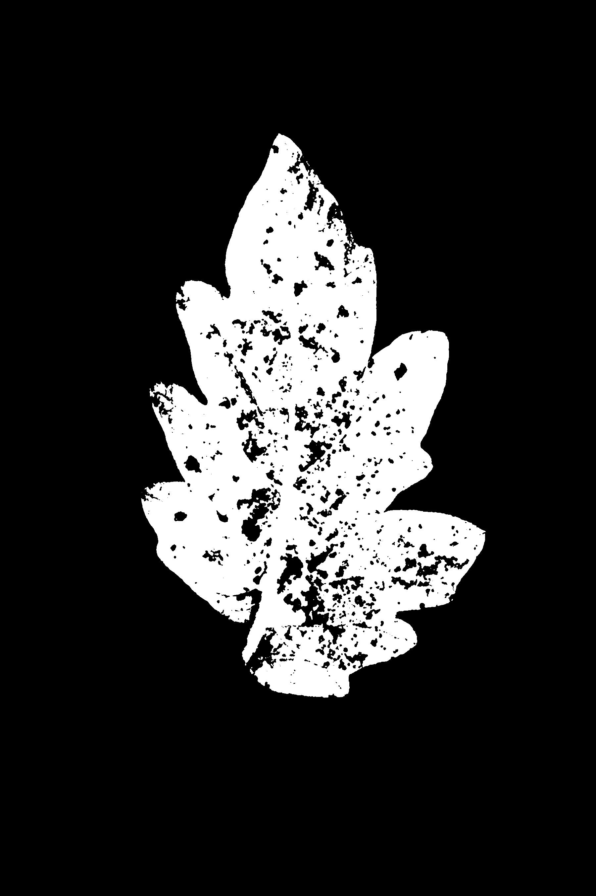 | 0.18 %
Xg_02_post.jpeg| |  |  | 0.28 %
Xg_04_post.jpeg|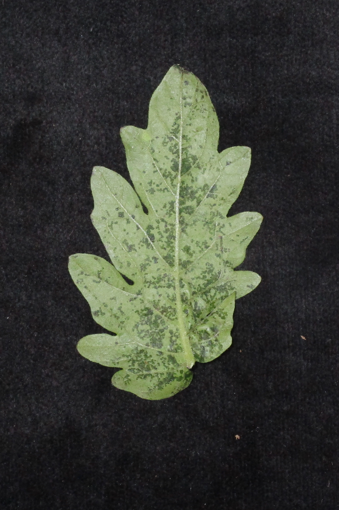 | 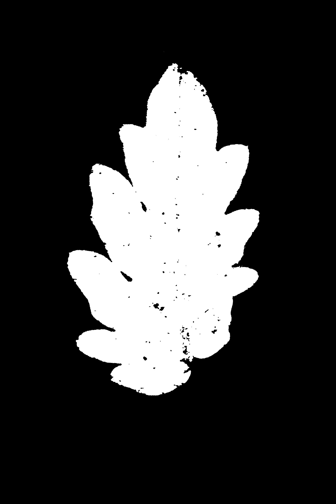 | 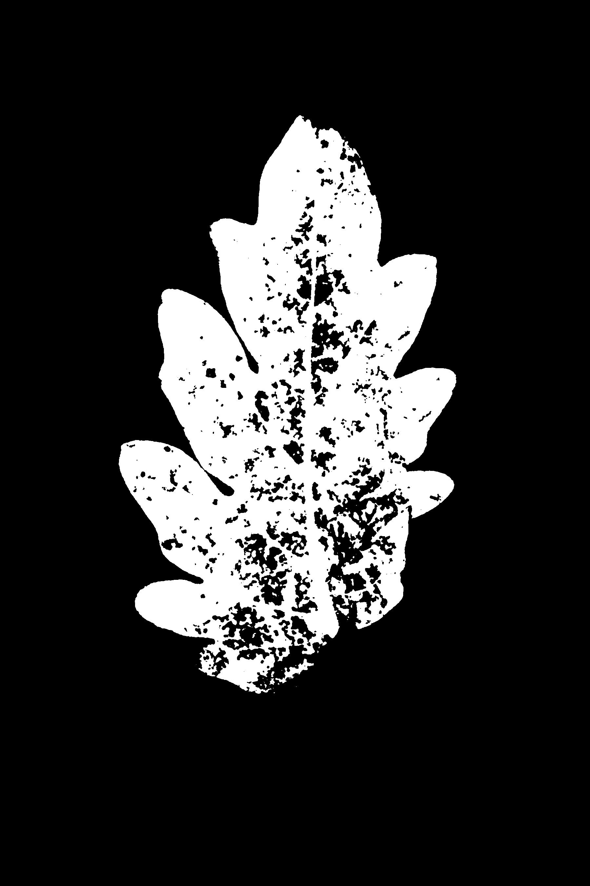 | 0.19 %
Xg_01_post.jpeg|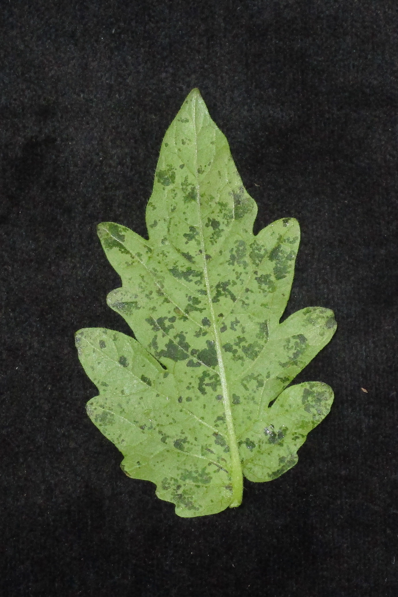 | 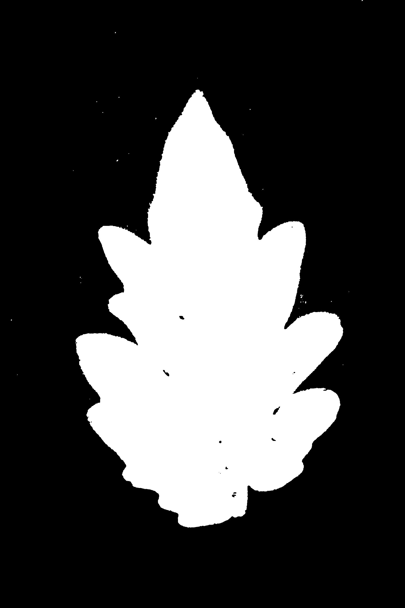 | 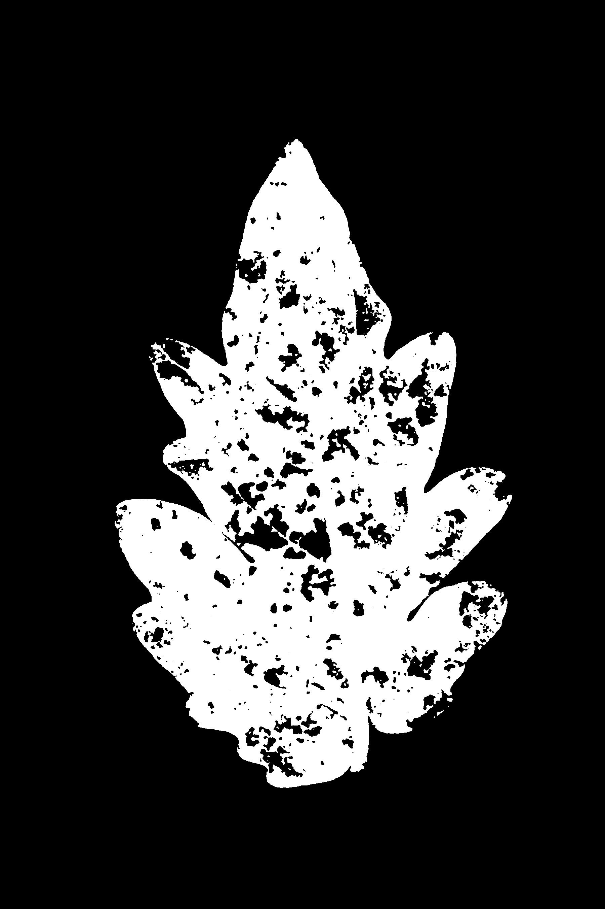 | 0.19 %
Xg_06_post.jpeg|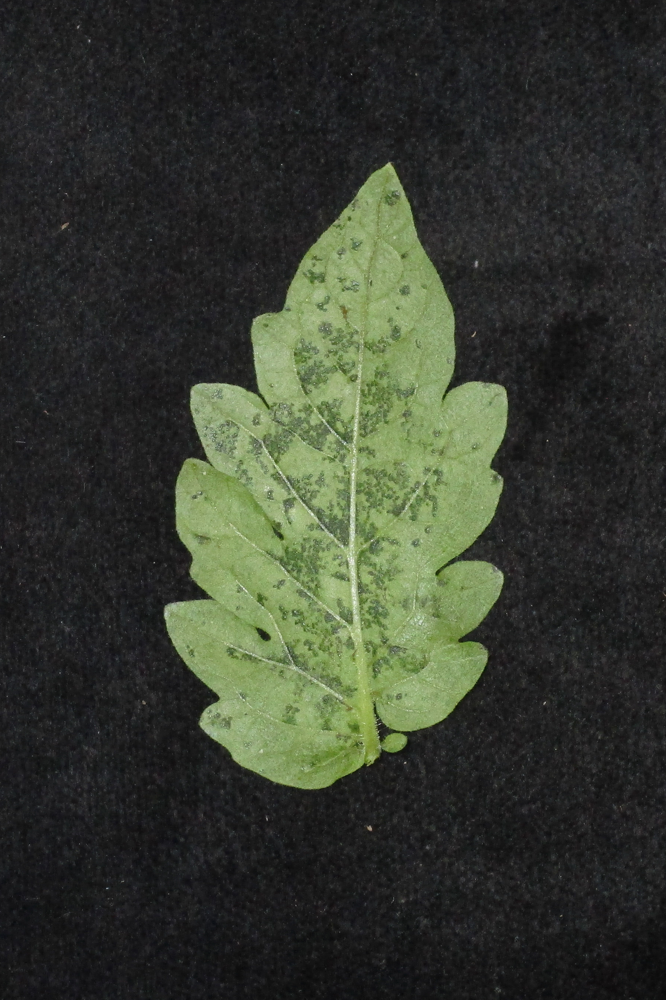 | 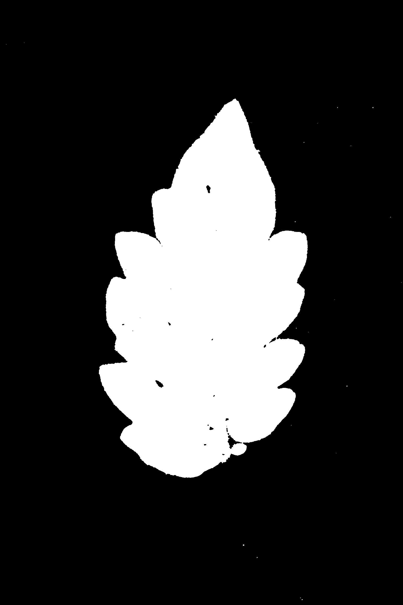 | 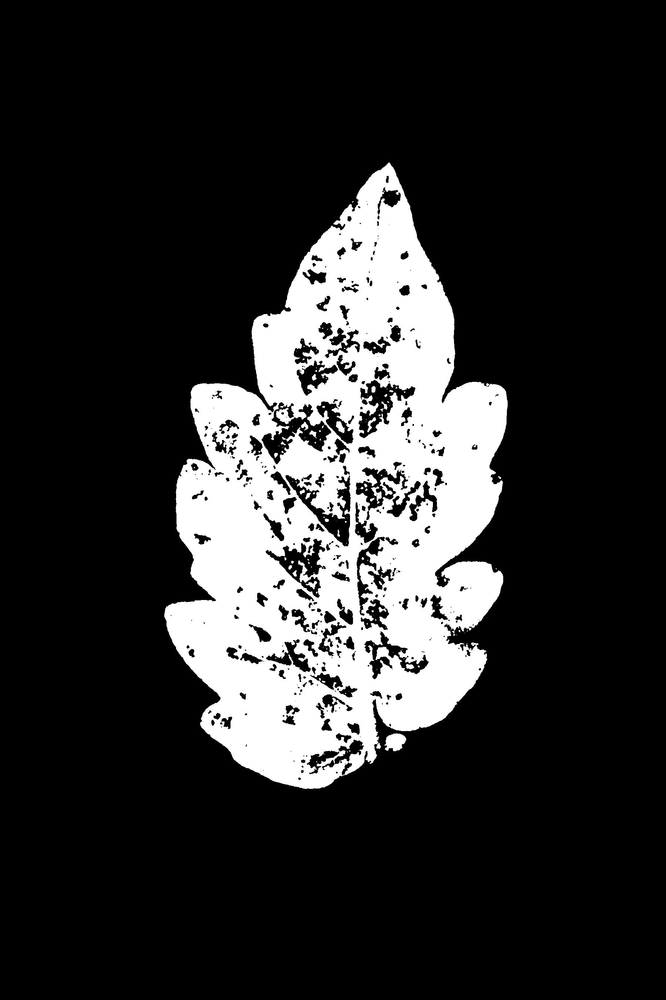 | 0.18 %
